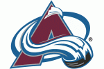
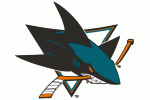
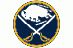
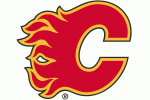
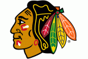

# NHL Rankings

After running the team tweets through the final model, the ranking of the teams are shown in the table below.

|Ranking| Team | Positivity Score|
| --------- | ------------- |:-------------:|
|1| | 0.707800 |
|2| | 0.700027 |
|3| | 0.694269 |
|4| | 0.692764 |
|5| | 0.691150 |
|6| | 0.689593 |
|7| | 0.688557 |
|8| | 0.685668 |
|9| | 0.683068 |
|10| | 0.680438 |
|11| | 0.673547 |
|12| | 0.668847 |
|13| | 0.666481 |
|14| | 0.660425 |
|15| | 0.655994 |
|16| | 0.650761 |
|17| | 0.646160 |
|18| | 0.645995 |
|19| | 0.618353 |
|20| | 0.611547 |
|21| | 0.610007 |
|22| | 0.608599 |
|23| | 0.604013 |
|24| | 0.600806 |
|25| | 0.593559 |
|26| | 0.586288 |
|27| | 0.578462 |
|28| | 0.570220 |
|29| | 0.568190 |
|30| | 0.562418 |
|31| | 0.557760 |

It is surprising to see all teams having more positive tweets than negative tweets. However, the week that the tweets were collected was right before the All-Star break and every team sends one player to the game. I think tweets are a little more positive as every team's fans get to see something good happen, even if their season isn't going well. Also, I collected bloggers' tweets and based on the blogs that I've read, their tweets are generally more positive than regular fans that reply to team accounts.

Despite the tweets being overly positive, the rankings do, for the most part, reflect how the season is going. The teams at the bottom were not playing well (Blackhawks, Oilers, Senators), while the teams at the top were playing well (Kings, Predators, Avalanche). 

## NHL Rankings Comparison
The top three models were used to classify the team tweets. The chart below shows the different rankings.

|Rank| Team | Positivity Score Final | | Team | Positivity Second Model | | Team | Positivity Third Model |
|-------------| :-------------:|:-------------:|:-------------:|:-------------:|:-------------:|:-------------:|:-------------:|:-------------:|
|1||0.707800| || 0.719829| ||0.670547|
|2||0.700027| ||0.701100| ||0.653072|
|3||0.694269| ||0.699509| ||0.652494|
|4||0.692764| ||0.697628| ||0.649031|
|5|| 0.691150 | ||0.697170| ||0.641504|
|6||0.689593|||0.691941| ||0.640676|
|7||0.688557| ||0.690950| ||0.638772|
|8||0.685668| ||0.689943| ||0.637880|
|9||0.683068| ||0.687407| ||0.626945|
|10||0.680438| ||0.687347| ||0.622624|
|11||0.673547| ||0.676351| ||0.620871|
|12||0.668847| ||0.673444| ||0.619521|
|13||0.666481| ||0.670385| ||0.611067|
|14||0.660425| ||0.663791| ||0.607235|
|15||0.655994| ||0.660867| ||0.606925|
|16||0.650761| ||0.650761| ||0.601785|
|17||0.646160| ||0.648605| ||0.580566|
|18||0.645995| ||0.648292| ||0.579117|
|19||0.618353| ||0.623070| ||0.574480|
|20||0.611547| ||0.615678| ||0.574450|
|21||0.610007| ||0.613891| ||0.567691|
|22||0.608599| ||0.613162| ||0.567657|
|23||0.604013| ||0.611404| ||0.558468|
|24||0.600806| ||0.607863| ||0.555252|
|25||0.593559| ||0.597558| ||0.555150|
|26||0.586288| ||0.585763| ||0.553976|
|27||0.578462| ||0.582985| ||0.539795|
|28||0.570220| ||0.573461| ||0.527908|
|29||0.568190| ||0.570918| ||0.521430|
|30||0.562418| ||0.566910| ||0.511663|
|31||0.557760| ||0.554229| ||0.508828|

You can see the average rankings between the top three models. The rankings for the teams are relatively the same with the Naive Bayes model being the most different. The two Logisitic Regression models performed almost the same, which was to be expected.

# NHL Sentiment Analysis
This NHL Sentiment Analysis aims to rank all 31 NHL teams according to the positivity/negativity (sentiment) of Twitter tweets. The tweets were collected from January 20th through January 25th 2018, which was right before the All-Star break.
  
The repository contains the files for the gathering tweets about all 31 NHL teams from Twitter, cleaning the Twitter data, and exploring the initial dataset. It also contains the images that were not used in the Milestone Report, including tweets by hour of the day and word clouds.
